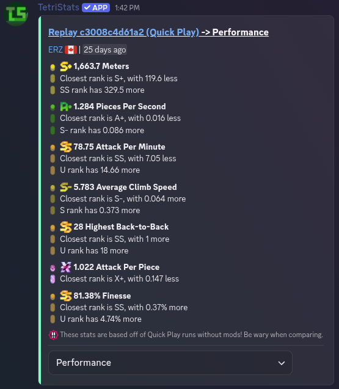
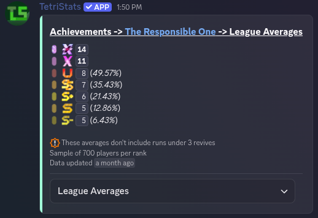
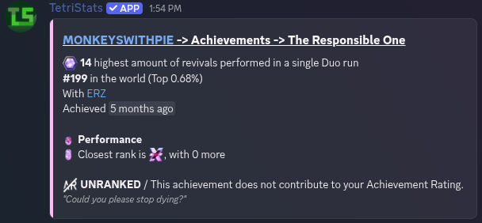
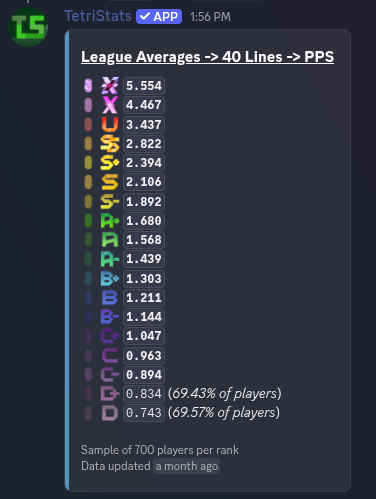

# TetriStats
**TetriStats** is an app built to provide easy viewing of TETR.IO stats directly in Discord. For example, TetriStats allows you to check how your stats compare to players with similar ranks.

## Features
### Replay Analysis

View detailed stats from your replays, and see how your performance compares to rank averages! The performance page shows which rank's average is closest to each of your stats, such as PPS, APP, and more!

###
### Achievment Statistics

View average achievement scores for each rank, and see how your score compares!
### Rank Averages

Look at average stats for each rank across a wide variety of stats, such as PPS in 40 lines.
