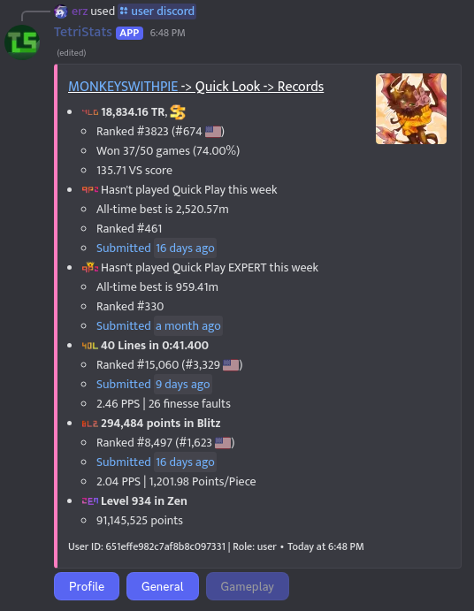
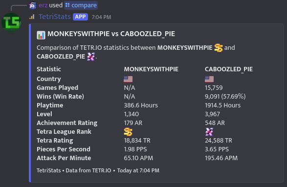
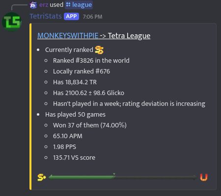
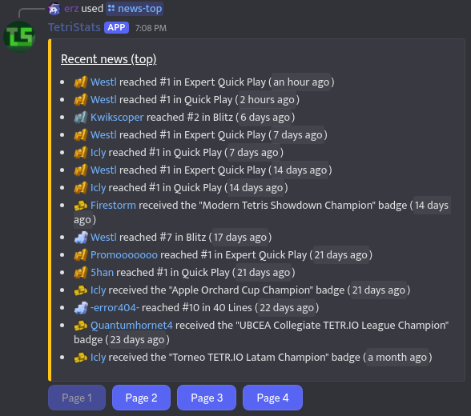
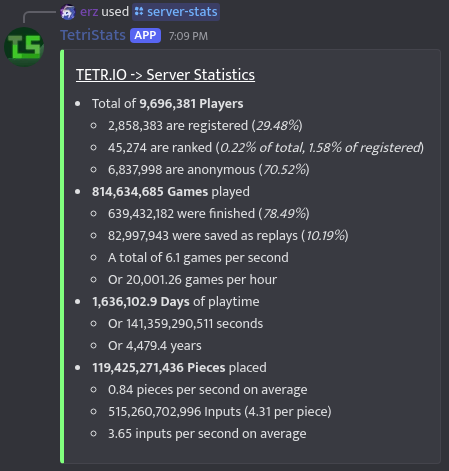

# TetriStats — TETR.IO Stats & Insights in Discord

**TetriStats** is a powerful, open-source Discord bot that provides detailed statistics, records, comparisons, and analysis for [TETR.IO](https://tetr.io/) players. Whether you're a casual grinder or a high-level player, TetriStats gives live TETR.IO data straight to your server.

- 💡 Built with ❤️ for the TETR.IO community, by [@erzahoq](https://github.com/erzahoq) and [@monkeyswithpie](https://github.com/monkeyswithpie)

## ✨ Features

### 📈 In-Depth Player Statistics

View detailed user profiles, including VS, PPS, TR, win/loss records, displayed achievements, and more!

### 🆚 Player Comparison

Compare any two users to see who really comes out on top, with a full side-by-side breakdown of playstyle, winrate, speed, and consistency.

### 🔍 Tetra League Insight

Get current data on a player’s current TR, Glicko rating, rank, and league performance. 

### 📰 TETR.IO News & Records

See recent updates and events straight from the Tetra Channel, including major record-breaking plays and leaderboard changes.

### 🌐 Global Server Stats

Want to know how many games are played on TETR.IO every second? How many pieces have been placed? View complete server-wide statistics in one command.

### (Coming Soon!) Replay Analysis

Upload .ttr replay files to get a breakdown of APM, PPS, finesse, match results, and other gameplay stats. Great for self-review or analyzing others.

## 🛠️ Installation & Usage

To invite TetriStats to your server:

[➡️ Click here to add TetriStats to your Discord server](https://discord.com/oauth2/authorize?client_id=1277041428274479124)

After inviting, try commands like /stats, /compare, /league, /records, or /replay to get started!
## 🔗 Links

- [GitHub](https://github.com/erzahoq/TetriStats)
- [Tetra Channel](https://ch.tetr.io/)
- [TETR.IO](https://tetr.io)

## 🤝 Credits

- Created by [@erzahoq](https://github.com/erzahoq) and [@monkeyswithpie](https://github.com/monkeyswithpie)
- Uses the [TETR.IO public API](https://tetr.io/about/api/)
- Game and data provided by osk, creator of TETR.IO