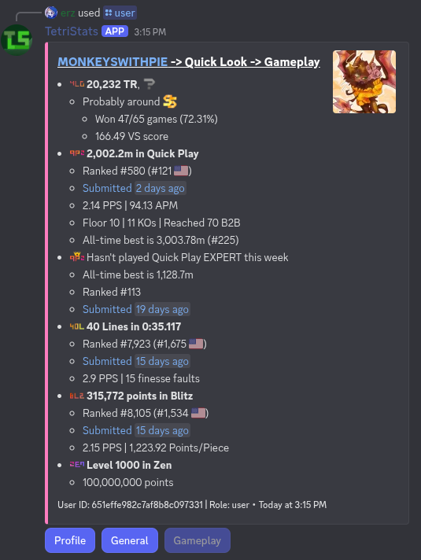
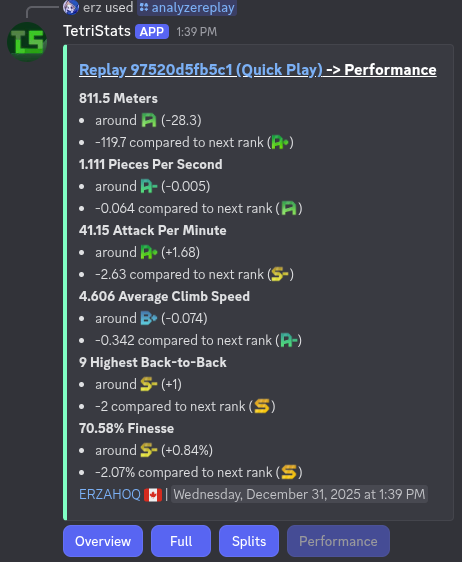
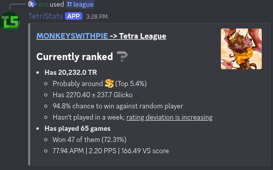
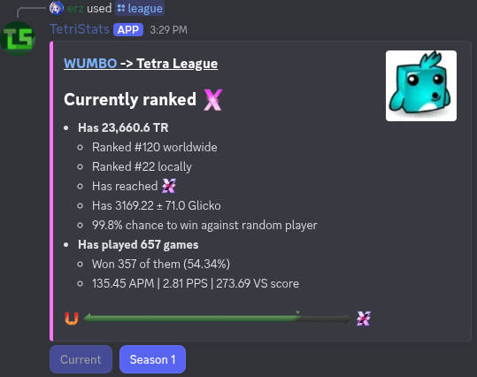
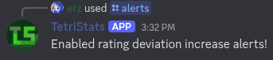
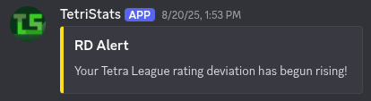
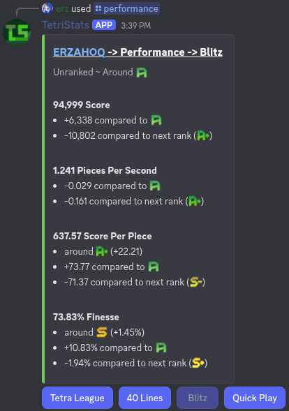

# TetriStats
## TETR.IO Stats and Performance Viewer in Discord

**TetriStats** is a Discord bot designed to give statistics, replay analysis, records, and more for [TETR.IO](https://tetr.io/) players. TetriStats gives live TETR.IO data straight to you and your server, whether you're a casual or high-level player.

Built with ❤️ for the TETR.IO community, by [@erzahoq](https://github.com/erzahoq) and [@monkeyswithpie](https://github.com/monkeyswithpie)

## Features

## Player Statistics

View user profiles with detailed info, including PPS, VS score, TR, displayed achievements, and more!

## Replay Analysis

Upload .ttr replay files and get a breakdown of the replay, alongside a performance report for each statistic.
TetriStats compares replay statistics with **nearly 10,000 users** to provide up-to-date rank data.

## Tetra League
### Tetra League Statistics

TetriStats allows you to find users and view their league statistics, including TR, rank, and past season info.

### Tetra League RD Alerts

Enable alerts from TetriStats, allowing it to automatically DM you when your Rating Deviation starts increasing!

## Player Performance

Use the `/performance` command and get rated on each gamemode, and where to improve!

## ...And Much More!

- See achievements of a user with `/achievement-info`
- Compare two users with `/compare`
- View general server stats with `/server-stats`
- View recent world records with `/news-top`
...

## Installation & Usage

To invite TetriStats to your server:

[➡️ Click here to add TetriStats to your Discord server](https://discord.com/oauth2/authorize?client_id=1277041428274479124)

After inviting, try commands like /stats, /compare, /league, or /records to get started!
## Links

- [GitHub](https://github.com/erzahoq/TetriStats)
- [Tetra Channel](https://ch.tetr.io/)
- [TETR.IO](https://tetr.io)

## Credits

- Created by [@erzahoq](https://github.com/erzahoq) and [@monkeyswithpie](https://github.com/monkeyswithpie)
- Uses the [TETR.IO public API](https://tetr.io/about/api/)
- Game and data provided by osk, creator of TETR.IO
